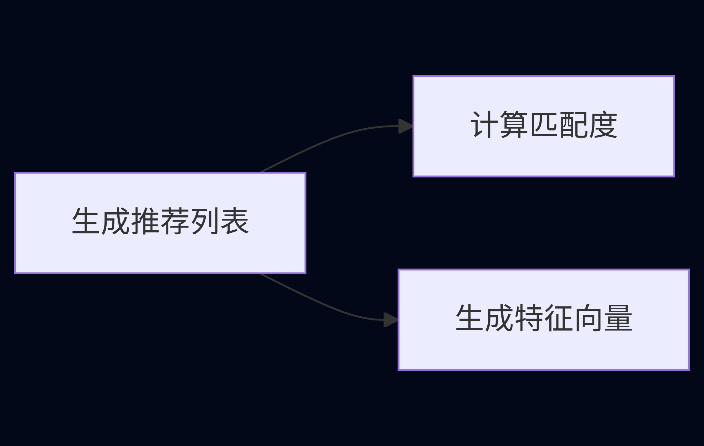
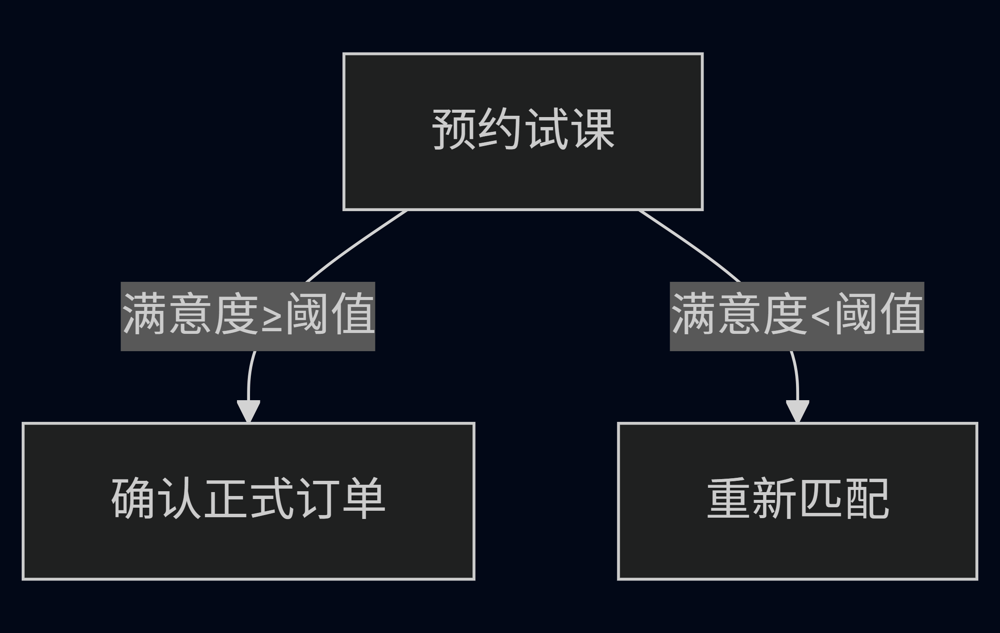
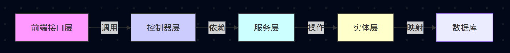
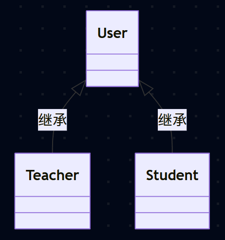
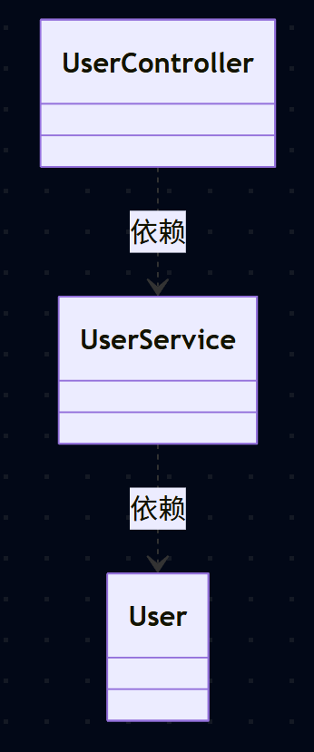
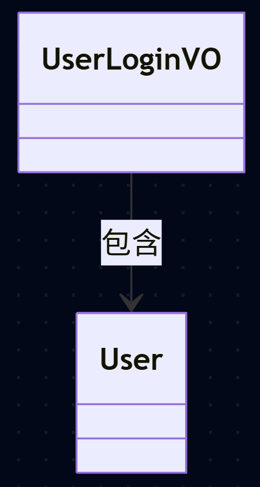
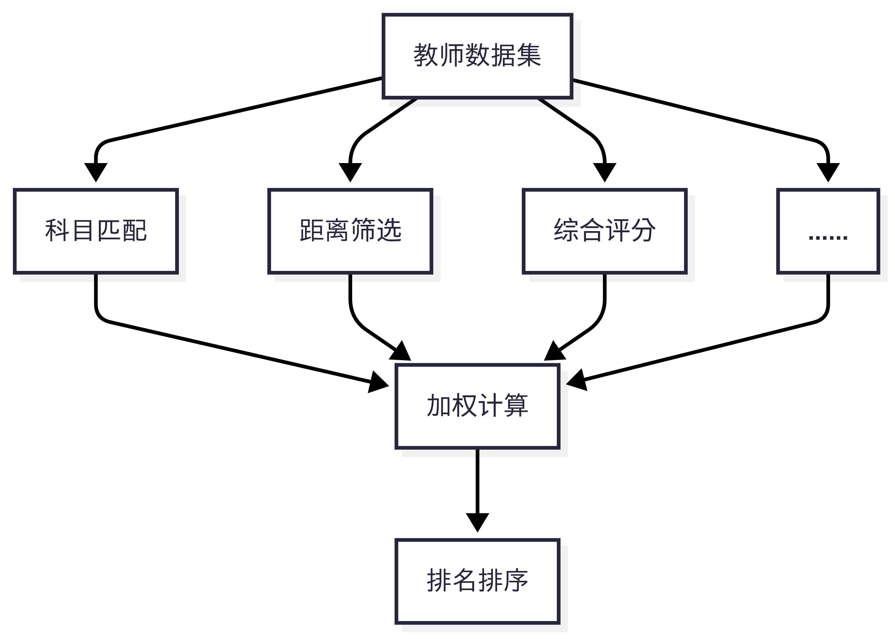
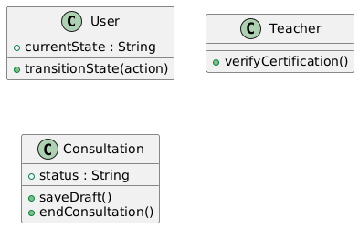

# 系统建模报告：智能家教平台

## 1. 引言
### 1.1 文档目的

本报告旨在通过UML标准建模语言，系统地描述“智能家教平台”的软件设计结构与行为模型。重点呈现功能边界、用户交互逻辑、核心业务实体及动态协作流程，形成面向开发的理论依据与实现蓝图，确保系统设计满足降低中介成本、提升匹配效率的核心目标。

### 1.2 系统概述
| **属性**       | **说明**    |
|----------------|--------------------------------|
| 系统名称       | 智能家教平台      |
| 核心目标       | 1. 建立家长与家教老师的直接对接机制，消除传统中介成本<br>2. 通过精准检索与智能推荐算法提升匹配效率，高效匹配双方需求<br>3. 优化用户体验，减少用户试错的时间与经济损耗  |
| 核心价值       | 构建去中心化的可信连接平台，以技术驱动家教资源配置效率最大化  |

## 2. 系统目标与范围
### 2.1 核心目标
- **​资源聚合**：​​ 结构化存储家教老师资质、教学领域、时间档期信息
- ​​**需求感知**：​​ 精确采集家长/学生的科目、地域、预算、时间约束
- **智能撮合**：​​ 基于多维度规则（如教学经验、地理位置、科目匹配度、历史评价）实现双向推荐
- **信任构建**：​​ 通过资料验证、用户评价体系及直接沟通建立可信连接

### 2.2 功能范围

|功能模块|核心能力|
|:-|:-|
|用户账户|注册、登录、密码管理|
|资料管理|家长/老师完善个人信息档案|
|需求发布|家长发布家教需求；老师发布教学资源/时间档期|
|检索与推荐|家长检索老师资料；老师检索需求；系统双向智能推荐匹配对象|
|连接与沟通|用户查看他人完整主页；通过站内消息发起私信沟通|
|评价系统|家长对老师进行评分与文字评价；老师可回应评价|

### 2.3 系统排除功能
- ❌ **在线支付**：任何形式的资金托管、支付接口或佣金结算功能均不属于本系统
- ​❌ **课程排课系统**：​​ 具体课程时间协调、日历管理由用户线下沟通
- ​​❌ **教学实施平台**：​​ 不提供在线授课工具（如视频会议、白板等）
- ❌ **法律协议签署**：​​ 合同签订与法律保障由用户自行负责

## 3. 用户角色

|角色|职责描述|
|:-|:-|
|家教老师|• 注册并创建详细教学档案（科目、资历、可授课时间/地点等）<br>• 检索家长/学生需求<br>• 接收系统推荐的学生列表<br>• 接受/拒绝家长沟通请求<br>• 管理个人主页展示信息<br>• 回应家长评价|
|家长/监护人|• 注册并创建学生档案（需辅导科目、区域、预算等）<br>• 检索符合条件的家教老师资料<br>• 接收系统推荐老师列表<br>• 主动申请心仪老师沟通<br>• 对完成服务的老师进行评分与评价|
|学生（高年级）|• 可自行完成档案维护、检索老师、发起沟通（权限受监护人设置限制）|


## 4. 功能模型
### 4.1 用例图模型

<div align="center">
    
    <p><i>用例图模型</i></p>
  </div>

### 4.2 功能域分解

|功能域|核心用例|业务价值|
|:-|:-|:-|
|身份认证|注册登录，完善或修改资料|建立可信用户档案|
|需求管理|发布具体需求，浏览家长需求列表|精准定义和发现服务请求|
|智能匹配|计算匹配度，生成特征向量，生成推荐列表|AI驱动降低匹配成本|
|连接交互|申请匹配，接受/拒绝私聊请求|实现双边自主撮合|
|信用建设|查勘老师信息，评价家教|构建去中介化信任机制|

### 4.3 关键关系解析

1. 包含关系（<\<include>>）
生成推荐列表强制调用了两个子过程：计算匹配度、生成特征向量。因此，推荐列表的生成过程可以视为包含关系。

        


2. 扩展关系(<\<extend>>)
模型中预约试课部分的功能可以视为扩展关系。

        

### 4.4 功能模型验证

1. **核心指标达成检测**

    |系统目标|支撑用例|
    |:-|:-|
    |降低中介成本|申请匹配 + 接受、拒绝私聊请求|
    |提升匹配效率|生成推荐列表 + 计算匹配度|
    |减少试错损耗|查看老师信息 + 特征向量匹配|

2. **范围一致性检查**
所有功能均在2.2表格所示范围中

## 5. 静态结构模型

### 5.1 核心类图模型

<div align="center">
    
    <p><i>类图模型</i></p>
  </div>

### 5.2 核心类职责说明
#### 5.2.1 实体类

|类名|职责|关键属性|关键方法|
|:-|:-|:-|:-|
|User|存储用户基础信息|uid, username, password,avatar|getUid(), setPassword()|
|Teacher|扩展教师特有属性|subject, certification|-|
|Student|扩展学生特有属性|grade, parentPhone|-|

设计原则：
- 符合开闭原则（OCP）；通过继承扩展用户类型
- 单一职责原则（SRP）：各实体类职责明确分离

#### 5.2.2 服务层

|类名|职责|关键方法|
|:-|:-|:-|
|UserService|处理核心业务逻辑|login(), updateUserInfo(), findUserById()|

#### 5.2.3 数据传输对象

|类型|类名|用途|关键字段|
|:-|:-|:-|:-|
|输入DTO|UserLoginDTO|登录参数传输|username, password|
|输入DTO|UserChangeInfoDTO|用户新修改参数|uid, newPassword|
|输出VO|UserLoginVO|登录结果视图对象|token, userInfo|
|输出VO|UserPageVO|用户主页视图对象|basicInfo, teachingSubjects|

数据转换过程：
```dotnetcli
前端 → DTO → 控制器 → 服务层 → 实体 → 数据库
数据库 → 实体 → 服务层 → VO → 控制器 → 前端
```

### 5.3 类关系与架构分层
#### 5.3.1 分层架构解析

 

#### 5.3.2 关键关系说明

1. 泛化关系
实现用户角色的多态性，支持用户角色的扩展。
 


2. 依赖关系
跨层调用通过接口依赖，降低耦合
 


3. 关联关系
VO对象组合实体信息，实现数据安全过滤
 

### 5.4 设计原则应用
#### 5.4.1 SOLID原则实现验证

|原则|实现证明|
|:-|:-|
|单一职责原则（SRP）|控制器仅处理请求路由，服务层封装业务逻辑|
|开闭原则（OCP）|通过User基类扩展。支持新的用户类型|
|里氏替换原则（LSP）|Teacher/Student可完全替代User使用|
|接口隔离原则（ISP）|专用DTO/VO对象避免“胖接口”问题|
|依赖倒置原则（DIP）|高层模块通过抽象接口依赖服务层|

#### 5.4.2 领域驱动设计（DDD）应用

领域模型构成：

```dotnetcli
聚合根：User
实体：Teacher, Student
值对象：UserLoginVO, UserPageVO
仓储接口：UserRepository（隐含）
```

### 5.5 与动态模型对接点
#### 5.5.1 序列图中协作

1. 登录流程

    ```dotnetcli
    UserController.login() 
    → UserService.login() 
    → JWT.generate()
    ```

2. 信息修改流程

    ```dotnetcli
    UserController.updateInfo()
    → UserService.updateUserInfo()
    → User.setPassword()
    ```
    
#### 5.5.2 状态图关联实体

1. User状态变化

    ```
    未激活 → 激活 → 禁用
    ```

2. Teacher认证状态

    ```dotnetcli
    未认证 → 审核中 → 已认证
    ```
    

## 6. 动态行为模型

### 6.1 核心交互流程（序列图分析）

#### 6.1.1 用户注册/登录流程

<div align="center">
    
    <p><i>用户注册/登录序列图模型</i></p>
  </div>

关键路径分析：

1. 新用户注册分支
成功验证之后，创建用户档案

    |验证结果|用户类型|系统响应|
    |:-:|:-:|:-:|
    |成功|教师|信息录入教师数据库|
    |成功|学生|信息录入学生数据库|

2. 登录分支
账号和密码成功认证后，进入用户主页

    |认证结果|系统响应|
    |:-:|:-:|
    |成功|进入用户主页|
    |失败|跳转到注册页面注册新账号|

#### 6.1.2 用户信息管理流程

<div align="center">
    
    <p><i>教师信息管理序列图模型</i></p>
  </div>

<div align="center">
    
    <p><i>学生信息管理序列图模型</i></p>
  </div>

关键路径分析：

1. 首次登录强制完善
用户在第一次登录进入个人主页时，必须完善个人信息档案，否则无法进行后续匹配流程


#### 6.1.3 智能匹配流程 

<div align="center">
    
    <p><i>智能匹配序列图模型</i></p>
  </div>

关键路径解析：

1. 触发阶段：

    - 用户输入个人资料（InputSelfProfile）
    - 通过边界类提交至控制器（SubmitUserInfo）

2. 分支处理：

    - 教师：检索学生数据库
    - 学生：检索教师数据库

3. 智能筛选算法：

    

4. 结果反馈：

    - 控制器整合结果返回界面
    - UI层向用户展示推荐列表

### 6.2 关键状态变化

<div align="center">
    
    <p><i>智能匹配序列图模型</i></p>
  </div>

#### 6.2.1 关键状态解析

|状态|准入条件|允许操作|设计约束|
|:-|:-|:-|:-|
|未登录|初始状态|注册/登录|限制访问核心功能|
|注册|新用户触发|填写资料|必填字段验证|
|首页|登录成功|导航所有功能|区分教师/学生视图|
|聊天|家教沟通|文件共享、非即时性通讯|端到端加密|

### 6.3 动作模型验证

#### 6.3.1 模型一致性检查

|序列图流程|对应状态转换|
|:-|:-|
|用户注册|notLogged -> signUp -> loggedIn|
|首次登录|loggedIn -> homepage|
|修改信息|进入个人信息页面|

#### 6.3.2 关键路径性能分析

1. 匹配流程优化点：

    

### 6.4 动态模型与静态结构关联

#### 6.4.1 序列图与类图映射

|序列图组件|对应类|方法调用|
|:-|:-|:-|
|SearchController|MatchController|searchStudents()<br>searchTeachers()|
|RecommendationEngine|MatchEngine|calculateWeightedScore()<br>sortResults()|
|Agent|UserService|updateProfile()<br>validateFirstLogin()|

#### 6.4.2 状态图实体映射



## 7. 总结与展望

- **模型价值**：​​ 本建模完整刻画了系统在降低中介成本（去支付化设计）、提升匹配效率（智能推荐算法建模）、减少试错损耗（评价体系与信用约束）上的理论可行性
- ​**局限性**：​​ 未包含的支付模块需第三方系统对接；教学效果反馈机制可进一步深化
- **理论贡献**：​​ 为双边市场平台建模提供可复用的UML表达范式，尤其在需求-资源动态匹配建模上具有方法论参考意义