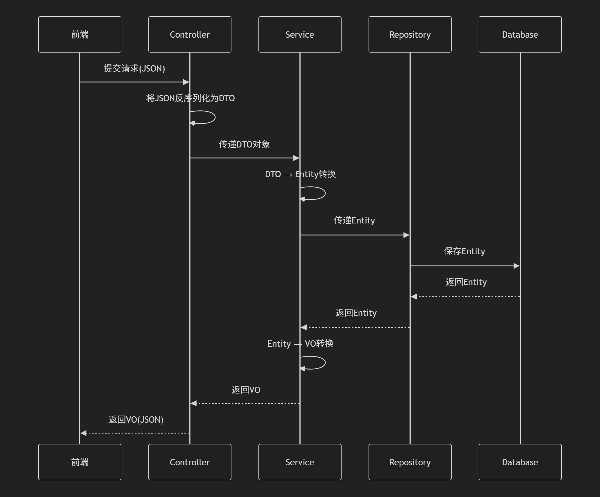
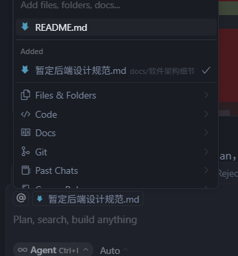

# 简介

## 技术栈

- 编程语言：Java
- 构建工具：Maven
- 框架：Spring Boot
- 日志框架：SLF4J + Logback
- API 测试工具：Postman
- 数据库：MySQL
- 数据库管理工具：MySQL Workbench
- IDE：IntelliJ IDEA Community Edition 或 VS Code

## 软件安装步骤

* 上面所需要的技术栈都可以去B站找视频对照着安装。

## 各个技术栈的用途

* Java作为项目的主要开发语言，Java 提供了跨平台能力、强大的面向对象特性和丰富的生态系统。Spring Boot 框架基于 Java 构建。
* Maven用于项目依赖管理和构建自动化。Maven 通过 pom.xml 文件管理项目所需的所有库依赖（如Spring Web,MySql Driver），自动下载并解决依赖关系，同时提供标准的项目结构和构建生命周期（编译、测试、打包等）。
* Spring Boot简化 Spring 应用的初始搭建和开发过程。它提供了自动配置、内嵌服务器（如Tomcat）、健康检查等开箱即用的功能，让我们能快速构建独立运行的、生产级别的基于Spring的应用程序。
* SLF4J + Logback。SLF4J：作为日志门面，提供统一的日志API，使代码不直接依赖具体的日志实现。Logback：作为实际的日志实现，提供高性能的日志记录功能，支持灵活的配置和多种输出格式。组合使用可以实现：调试信息记录、错误追踪、运行时监控等功能
* Postman用于测试和调试RESTful API，可以发送HTTP请求(GET/POST/PUT/DELETE等)，查看相应结果等。
* MySQL：存储数据
* MySQL Workbench：图形化界面工具
* IDE：代码编辑平台。

## SpringBoot 项目结构说明

```
src/
├── main/
│   ├── java/                   # Java 源代码目录
│   │   └── com/example/demo/   # 主包目录
│   │       ├── controller/     # 控制器层，处理 HTTP 请求
│   │       ├── service/        # 服务层，处理业务逻辑
│   │       ├── repository/     # 数据访问层，与数据库交互
│   │       ├── model(pojo)/    # 实体类，对应数据库表
│   │       ├── dto/            # 数据传输对象，前转后
			├── vo/             # 视图对象，后转前展示
│   │       ├── (config)/         # 配置类
│   │       └── DemoApplication.java  # 应用程序入口
│   └── resources/              # 资源文件目录
│       ├── static/             # 静态资源（CSS、JS等）
│       ├── templates/          # 模板文件
│       └── application.properties  # 应用配置文件
└── test/                       # 测试代码目录
    └── java/
        └── com/example/demo/   # 测试类目录
```




### 目录结构说明

1. **controller 目录**
   - 包含所有 REST 控制器
   - 处理 HTTP 请求和响应，将HTTP请求传入服务层，将服务层传回的DTO对象返回给客户端。
   - 使用 `@RestController` 注解

2. **service 目录**
   - 包含业务逻辑实现
   - 使用 `@Service` 注解
   - 处理复杂的业务规则

3. **repository 目录**
   - 数据访问层接口
   - 使用 `@Repository` 注解
   - 继承 JpaRepository 实现数据库操作

4. **model 目录**
   - 实体类定义
   - 使用 `@Entity` 注解
   - 对应数据库表结构，即Java对象和数据库表的映射

5. **dto 目录**
   - 数据传输对象，对原始数据进行加工，从前端数据转后端实体类数据
   - 用于前后端数据交换
   - 可以包含验证注解

5. **vo 目录**
   * 从后端实体类对象数据转前端视图对象数据
   
6. **config 目录**
   - 配置类
   - 包含安全配置、跨域配置等
   - 使用 `@Configuration` 注解

7. **resources 目录**
   - application.properties：应用配置文件
   - static：静态资源文件
   - templates：模板文件（如果使用模板引擎）


## 配置文件说明

### application.properties 主要配置项

```properties
# 服务器配置
server.port=8080

# 数据库配置
spring.datasource.url=jdbc:mysql://localhost:3306/your_database
spring.datasource.username=root
spring.datasource.password=your_password
spring.datasource.driver-class-name=com.mysql.cj.jdbc.Driver

# JPA配置
spring.jpa.hibernate.ddl-auto=update
spring.jpa.show-sql=true
spring.jpa.properties.hibernate.dialect=org.hibernate.dialect.MySQL8Dialect

# 日志配置
logging.level.root=INFO
logging.level.com.example.demo=DEBUG
```

## 开发流程

1. 创建实体类（model）
2. 创建数据访问层（repository）
3. 创建服务层（service）
4. 创建控制器（controller）
5. 配置数据库连接
6. 使用 Postman 测试 API
7. 测试成功，创建DTO层和VO层

## AI编程方法

* 安装cursor
* 打开对应文件夹，在右边AI处发送对应问题，注意要选中对应的文件代码，使AI有访问权限。



## 注意事项

1. 确保所有依赖版本兼容
2. 遵循 RESTful API 设计规范
3. 使用适当的异常处理机制
4. 实现日志记录
5. 注意数据安全性


