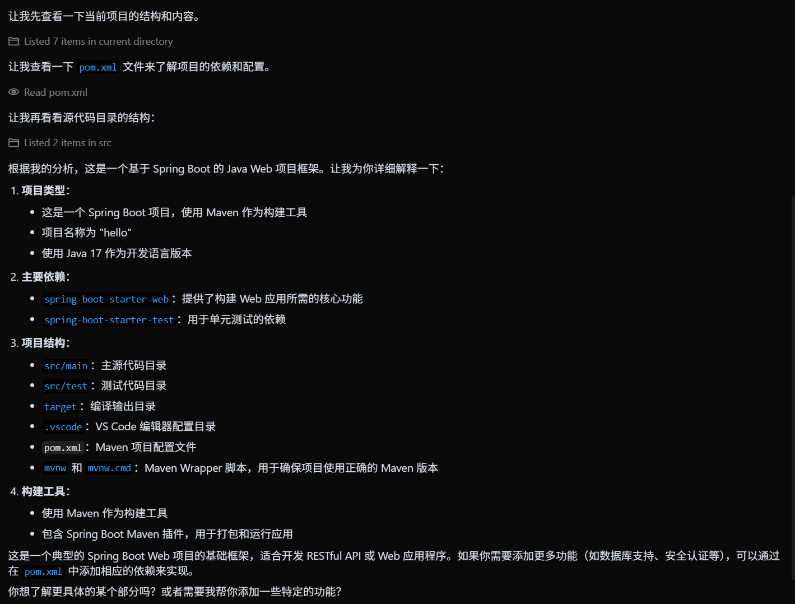

# 简介

技术栈

- 编程语言：Java
- 构建工具：Maven
- 框架：Spring Boot
- 日志框架：SLF4J
- API 文档：Swagger
- 数据库：mysql

软件安装：

1. 安装mysql8.0.42和其workbench软件
2. 安装idea社区版（使用vscode或其他软件应该可以，我没试）
3. 安装java21（idea可能会提示安装，如果没有自己安装下）
4. 其他内容可以在idea及其插件里自动下载

注：使用vscode需要另外安装maven（一个集成到idea的插件）

安装软件cursor/vscode并打开项目

可以在cursor里提问ai：

例如：**解释现在的这个框架**

