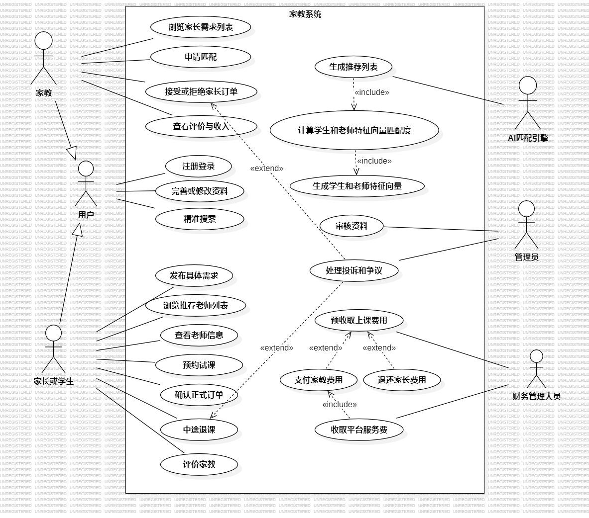

# 用例图

> 打开图片请使用其它打开方式，vscode上看图片不清晰

## 参与者：

* 家教和家长(学生)，泛化为用户
* AI匹配引擎
* 管理员
* 财务管理人员

## 用例及关系如图所示：

include指向被包含的用例

extend指向被扩展的用例（可以理解为发生条件），扩展用例可以不发生，如处理投诉与争议在家长中途退课的情况下可能触发

参考文章：[What is Use Case Diagram?](https://www.visual-paradigm.com/guide/uml-unified-modeling-language/what-is-use-case-diagram/)
