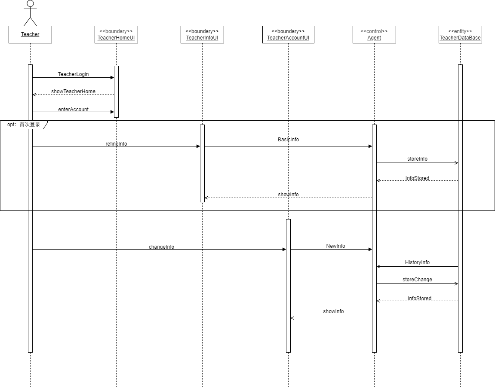

# Teacher_info

## 说明：
> 类说明：  
>+ 外部执行者：Teacher  
>+ <<boundary\>> TeacherHomeUI: 教师用户主页，显示搜索框，家教查询信息，推送之类的
>+ <<boundary\>> TeacherInfoUI：教师信息完善页面，可能包含*所在地位置，时间，科目，教师简历*等基础信息
>+ <<boundary\>> TeacherAccountUI：教师账户页，可能显示*个人信息，学生反馈*等
>+ <<control\>> Agent：AI接口，分析教师提交的信息，提取特征向量，生成分析报告和建议
>+ <<entity\>> TeacherDataBase：教师数据库，存储教师账户信息，包括部分历史信息

> 消息说明：
>+ TeacherLogin：教师登录信号，教师完成登录认证后进入教师主页
>+ showTeacherHome：显示教师主页
>+ enterAccount: 进入教师账户页
>+ refineInfo：完善个人信息
>+ BasicInfo：基础信息
>+ storeInfo：Agent处理后的信息，可能包含原信息和特征向量
>+ InfoStored：保存信息
>+ showInfo：显示个人信息，可能包含*填写的信息，分析报告，统计图*等
>+ changeInfo：变更信息，可能包含*地址，空闲时间，科目*等
>+ NewInfo：更改的新信息
>+ HistoryInfo：历史信息
>+ storeChange：保存变动信息