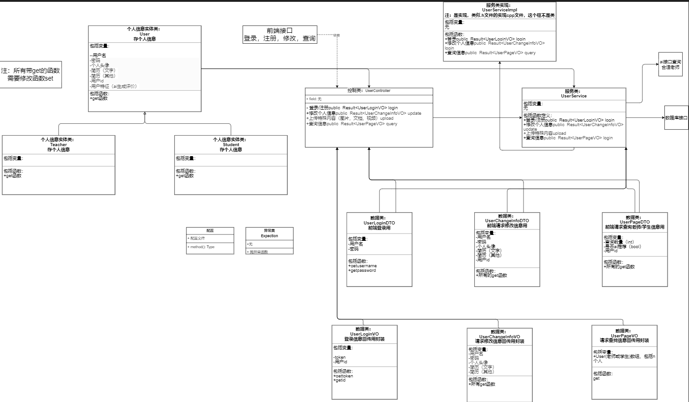
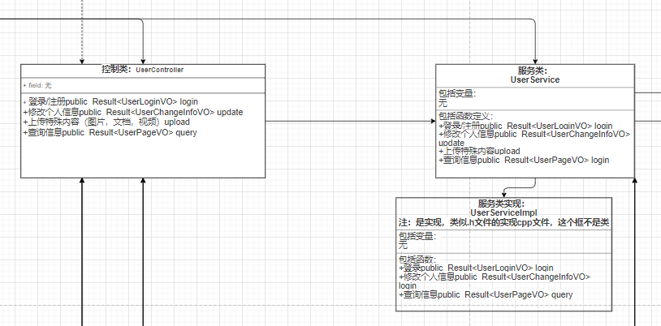
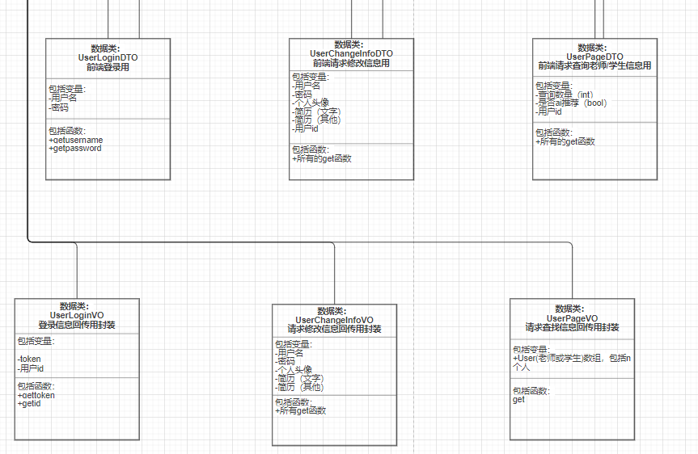
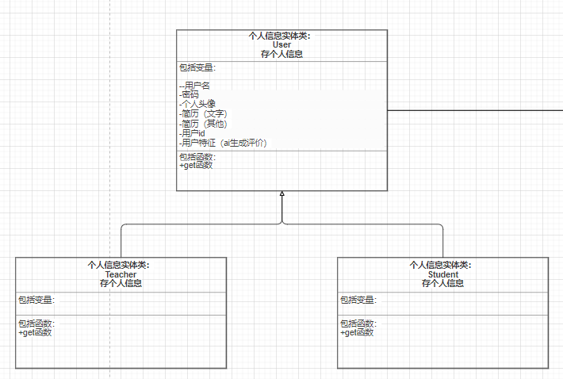
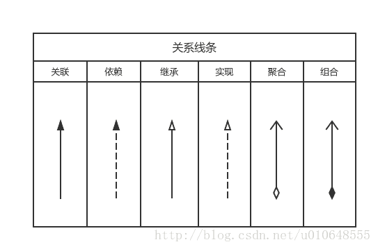

# 文件夹说明

本文件夹用于存放

+ 类图

## 包括文件

一个类的表格（废弃）

类的drawio文件：暂定

### 1个控制类UserController

### 1个服务类和其实现UserService和UserServiceImpl

### 6个数据类

### 3实体类（包括抽象的）

## 包括的类说明：

主要前三个

### 1. 控制类（Controller）

ai介绍：废话：控制类是后端系统中用于处理客户端请求的入口点（**第一层**）。它们的主要职责是接收用户请求，调用业务逻辑层（**Service层，第二层**）的方法来处理请求，并将处理结果返回给客户端。控制类通常与前端交互，是MVC（Model-View-Controller）架构中的“Controller”部分。

总结：前端传的东西到控制类

### 2. 服务类（Service）

废话：服务类是后端系统的核心业务逻辑层。它们封装了具体的业务逻辑，包括数据处理、业务规则的实现等。服务类通常不直接与数据库交互，而是通过调用数据访问层（DAO）的方法来操作数据。

总结：控制类调用服务类实现功能

### 3. 数据类（DAO）

废话：数据访问类（Data Access Object）是后端系统中用于与数据库交互的类。它们封装了数据库操作的细节，使得业务逻辑层（Service层）可以专注于业务逻辑，而不必关心具体的数据库操作。

总结：数据传输用数据类，前端与控制类之间叫VO，控制类和服务类之间叫DTO，因为有一些东西只能在后端传输不能给前端看，所以分类

4. 实体类（Entity）暂无

废话：实体类是后端系统中用于表示数据库表的类。它们通常与数据库表一一对应，用于存储和操作数据库中的数据。

5. 配置类（Configuration）

废话：配置类用于配置后端系统的各种设置，包括数据库连接、中间件配置、安全设置等。它们通常使用注解或XML文件来定义配置。

6. 工具类（Utility）暂无

废话：工具类用于封装一些通用的功能，如日期处理、字符串操作、文件操作等。这些类通常提供静态方法，方便在项目中复用。

7. 异常处理类（Exception Handler）

废话：异常处理类用于统一处理后端系统中的异常。它们可以捕获异常并返回友好的错误信息给客户端。

8. 安全类（Security）暂无

废话：安全类用于实现后端系统的安全机制，如用户认证、授权、密码加密等。

### 总结：

前端（请求）->封装到DTO（数据）->传输到1控制类（函数）->封装到DTO（数据）->传输到服务类（函数）

## 参考

[UML详解（1）：类的关系与如何绘制类图_怎么画uml类图-CSDN博客](https://blog.csdn.net/realmagicboy/article/details/90289062)

[软件设计——UML类图详解_软件设计类图-CSDN博客](https://blog.csdn.net/u010648555/article/details/54379051)

