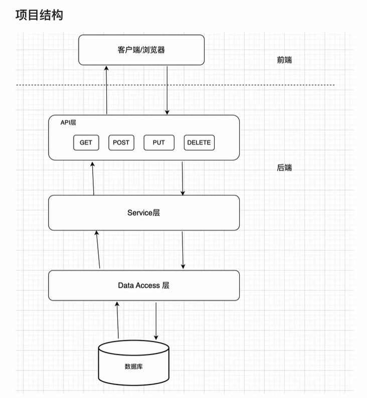

# 系统架构文档

**版本：V1.0**

**日期：2025年 07月 05日**

**编制人：郑晓丰**

## 一、系统整体架构

本项目采用**前后端分离**架构，前端基于 Vue 3 框架，后端基于 Spring Boot，数据持久化采用 MySQL 数据库。前后端通过 RESTful API 进行通信，前端负责页面渲染与交互，后端负责业务逻辑处理与数据存储。



## 二、前端架构设计

### 技术栈

- 框架：Vue 3
- 语言：JavaScript/TypeScript
- UI库：Element Plus
- 路由：Vue Router
- 状态管理：Pinia
- 样式：CSS3

### 目录结构

```
src/
├── assets/           # 静态资源
├── components/       # 复用组件（如表单、聊天窗口等）
├── router/           # 路由配置
├── store/            # 状态管理
├── utils/            # 工具函数和API封装
├── views/            # 页面视图（如主页、详情页等）
├── App.vue           # 根组件
├── main.ts           # 入口文件
└── style.css         # 全局样式
```

### 关键设计策略

- **组件化开发**：所有页面和功能均拆分为可复用的 Vue 组件，便于维护和扩展。
- **单页面应用（SPA）**：通过 Vue Router 实现页面无刷新切换，提升用户体验。
- **状态管理**：使用 Pinia 管理全局状态，如用户信息、会话状态等。
- **API 封装**：所有后端请求统一封装在 `utils/api.ts`，便于统一管理和错误处理。
- **响应式设计**：CSS 采用响应式布局，适配不同终端。
- **权限与路由守卫**：通过路由守卫实现页面访问控制（如未登录跳转登录页）。

### 界面设计

- [注册&登录界面](界面设计文档/注册&登录界面.md)
- [学生&教师主页](界面设计文档/学生&教师主页.md)
- [用户信息界面](界面设计文档/用户信息界面.md)
- [匹配信息界面](界面设计文档/匹配信息界面.md)
- [聊天界面](界面设计文档/聊天界面.md)

## 三、后端架构设计

### 技术栈

- 编程语言：Java
- 框架：Spring Boot
- 持久层：Spring Data JPA
- 构建工具：Maven
- 日志：SLF4J + Logback
- 数据库：MySQL


### 目录结构

```
src/
├── main/
│   ├── java/
│   │   └── org/tutorial/tutorial_platform/
│   │       ├── controller/     # 控制器层，处理HTTP请求
│   │       ├── service/        # 业务逻辑层
│   │       │   └── serviceImpl/# 业务实现
│   │       ├── repository/     # 数据访问层
│   │       ├── pojo/           # 实体类
│   │       ├── dto/            # 数据传输对象
│   │       ├── vo/             # 视图对象
│   │       ├── config/         # 配置类
│   │       ├── util/           # 工具类
│   │       └── TutorialPlatformApplication.java # 应用入口
│   └── resources/
│       ├── static/             # 静态资源
│       ├── templates/          # 模板文件
│       └── application.properties # 配置文件
└── test/
    └── java/
        └── org/tutorial/tutorial_platform/  # 测试类目录
```

目录结构说明

1. **controller 目录**
   - 包含所有 REST 控制器
   - 处理 HTTP 请求和响应，将HTTP请求传入服务层，将服务层传回的DTO对象返回给客户端。
   - 使用 `@RestController` 注解

2. **service 目录**
   - 包含业务逻辑实现
   - 使用 `@Service` 注解
   - 处理复杂的业务规则

3. **repository 目录**
   - 数据访问层接口
   - 使用 `@Repository` 注解
   - 继承 JpaRepository 实现数据库操作

4. **pojo 目录**
   - 实体类定义
   - 使用 `@Entity` 注解
   - 对应数据库表结构，即Java对象和数据库表的映射

5. **dto 目录**
   - 数据传输对象，对原始数据进行加工，从前端数据转后端实体类数据
   - 用于前后端数据交换
   - 可以包含验证注解

6. **vo 目录**
   * 从后端实体类对象数据转前端视图对象数据

7. **config 目录**
   - 配置类
   - 包含安全配置、跨域配置等
   - 使用 `@Configuration` 注解

8. **util 目录**
   * 工具类
   * 包含JWT的生成、解析和拦截验证
   * 使用 `@Component` 注解，方便注入其他类中

9. **resources 目录**
   - application.properties：应用配置文件
   - static：静态资源文件
   - templates：模板文件（如果使用模板引擎）


### 关键设计策略

- **分层架构**：采用 Controller-Service-Repository 分层，职责清晰，便于维护和扩展。
- **RESTful API**：所有接口均遵循 RESTful 风格，接口语义清晰，便于前端调用。
- **DTO/VO 分离**：前后端数据传输采用 DTO/VO，避免直接暴露数据库实体，提升安全性和灵活性。
- **统一异常处理**：通过全局异常处理器，统一返回错误信息。
- **安全设计**：支持 JWT认证方式，防止未授权访问。
- **日志管理**：通过 SLF4J+Logback 记录操作日志、错误日志，便于问题追踪。


## 四、数据库设计

本项目采用 MySQL 数据库，以用户为核心，围绕师生信息、聊天、评价等业务进行表结构规划。主要思路如下：

1. **用户信息统一管理**
   所有用户（教师、学生）都在 `user` 表中统一管理，便于身份认证和权限控制。教师和学生的详细信息分别存储在 `teacher` 和 `student` 表，通过外键与 `user` 表关联，实现一对一扩展。
2. **师生扩展信息分表设计**
   教师和学生的个性化信息（如学历、授课年级、成绩、目标等）分别存储在 `teacher` 和 `student` 表，便于后续扩展和维护。
3. **聊天功能分层设计**
   聊天相关数据分为会话（`chat_session`）和消息（`chat_message`）两层。每个会话对应一组师生，所有消息通过 `session_id` 归属于某个会话，便于历史消息查询和会话管理。
4. **未读消息与状态高效统计**
   通过 `user_session_mapping`、`user_total_unread` 和 `user_status` 表，分别记录每个用户在各会话中的未读数、总未读数和在线状态，提升消息提醒和状态管理的效率。
5. **评价与评论管理**
   用户间的评价通过 `user_comment` 表进行管理，支持一对一评价和唯一性约束，保证评价数据的准确性。
6. **数据一致性与扩展性**
   采用主外键约束，保证数据一致性。各表自增主键设计，方便数据扩展和维护。


## 五、前后端交互流程

1. **用户登录/注册**：前端表单提交，后端校验并返回用户信息和认证凭证。

2. **信息展示与更新**：前端通过 API 获取/提交用户、教师、学生等信息，后端进行数据处理和持久化。

3. **智能匹配与评价**：前端发起匹配/评价请求，后端处理业务逻辑并返回结果。

4. **即时聊天**：前端发起会话请求/发送消息/拉取消息，后端负责创建会话/存储消息/返回消息列表。

5. **文件上传与下载**：前端通过表单上传文件，后端存储并返回可访问链接。


## 六、关键安全与性能策略

- **接口鉴权**：所有敏感接口需校验用户身份，即验证用户所持有Token是否与后端授权的一致
- **输入校验**：前后端均对用户输入进行校验，防止 SQL 注入、XSS 等安全问题。
- **分页与懒加载**：列表数据采用分页接口，提升性能和用户体验。
- **错误处理**：前后端均有完善的错误处理和提示机制。

