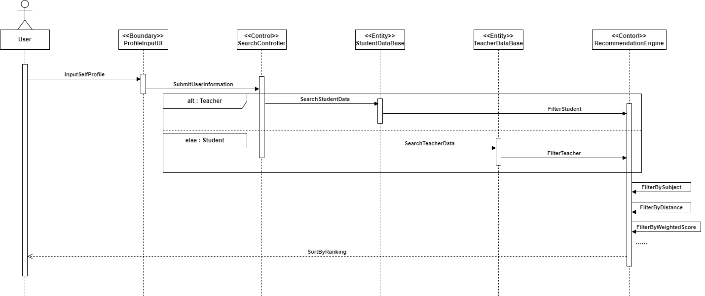

# bi-directional_search

## 说明

> 类说明：
> + 外部执行者：User(包括老师和学生)
> + `<<Boundary>> ProfileInputUI`: 检索需求输入页面。使用者输入额外的查询需求
> + `<<Control>> SearchController`: 检索跳转的等待页面。验证使用者身份，调用相应的数据库信息
> + `<<Entity>> StudentDataBase`: 学生数据库。初步检索符合条件的学生
> + `<<Entity>> TeacherDataBase`: 老师数据库。初步检索符合条件的老师
> + `<<Control>> RecommendationEngine`: 智能推荐引擎。调用智能推荐算法进一步检索匹配度最高的几名 学生(`User是老师`)/老师(`User是学生`)

> 消息说明：
> + `InputSelfProfile` ：使用者输入额外的检索需求
> + `SubmitUserInformation` ：把检索需求提交给搜索控制器
> + `SearchStudentData` ：在学生数据库检索
> + `SearchTeacherData` ：在老师数据库检索
> + `FilterStudent` ：初步筛选出符合条件的学生
> + `FilterTeacher` ：初步筛选出符合条件的老师
> + `FilterBySubject` ：调用学科匹配算法计算学科匹配度
> + `FilterByDistance` ：调用路程匹配算法计算路程匹配度
> + `FilterByWeightedScore` ：调用评分匹配算法计算评分匹配度(这里的评分是指以往教学经历中老师和学生的互评 以及 平台根据表现给出的评分)
> + `SortByRanking` ：智能推荐引擎根据计算出的匹配度，返回匹配度最高的几名候选对象，供使用者选择。