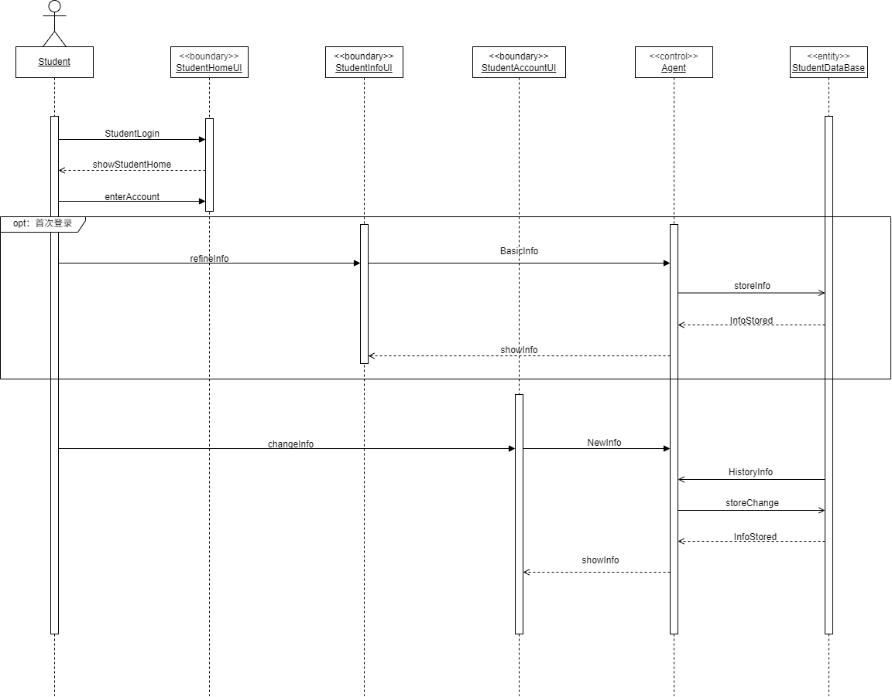

# Student_info

## 说明：
> 类说明：  
>+ 外部执行者：Student  
>+ <<boundary\>> StudentHomeUI: 学生用户主页，显示搜索框，家教查询信息，推送之类的
>+ <<boundary\>> StudentInfoUI：学生信息完善页面，可能包含*所在地位置，年级，科目，时薪或学生自述*等基础信息
>+ <<boundary\>> StudentAccountUI：学生账户页，可能显示*成绩变化曲线，分析报告，个人信息*等
>+ <<control\>> Agent：AI接口，分析学生提交的信息，提取特征向量，生成分析报告和建议
>+ <<entity\>> StudentDataBase：学生数据库，存储学生账户信息，包括部分历史信息

> 消息说明：
>+ StudentLogin：学生登录信号，学生完成登录认证后进入学生主页
>+ showStudentHome：显示学生主页
>+ enterAccount: 进入学生账户页
>+ refineInfo：完善个人信息
>+ BasicInfo：基础信息
>+ storeInfo：Agent处理后的信息，可能包含原信息和特征向量
>+ InfoStored：保存信息
>+ showInfo：显示个人信息，可能包含*填写的信息，分析报告，统计图*等
>+ changeInfo：变更信息，可能包含*地址，成绩，家教时间，目标*等
>+ NewInfo：更改的新信息
>+ HistoryInfo：历史信息
>+ storeChange：保存变动信息

